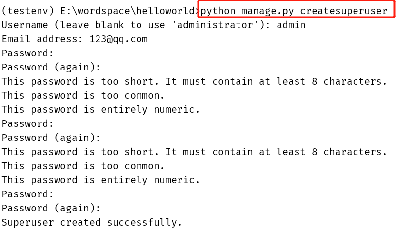

# 模型使用指南

### 前言
　　Djang自身集成了管理后台，在管理后台中可以对我们自定义model进行CRUD操作，也能进行列表展示解析，分页等等

#### 使用admin管理后台

##### 0. 准备工作，在model中定义Student的模型
    ```
    class Students(models.Model):
        name = models.CharField(max_length=10)
        sex = models.BooleanField()
    
        class Meta:
            db_table = 'student'
    ```

##### 1. admin管理后台的url
    在工程目录下可以看到路由配置中有一个admin的url地址
    ```
    url(r'^admin/', admin.site.urls),
    ```
##### 2. 创建admin后台的用户密码
    ```
    python manage.py createsuperuser
    ```
    

##### 3. 在登录后的管理后台中对自定义的模型进行CRUD操作
    在管理后台中操作模型对象。需要在app的admin.py中写如下代码
    ```
    admin.site.register(模型名)
    ```

##### 4. 继承admin.ModelAdmin，编写自定义的admin
    ```
    class StudentAdmin(admin.ModelAdmin):
        def set_sex(self):
            if self.sex:
                return '男'
            else:
                return '女'
        set_sex.short_description = '性别'
        list_display = ['id', 'name', set_sex]
        list_filter = ['sex']
        search_fields = ['name']
        list_per_page = 1
    
    admin.site.register(模型名, StudentAdmin)
    ```
    
    其中：<br>
    list_display: 显示字段  <br>
    list_filter: 过滤字段   <br>
    search_fields: 搜索字段 <br>
    list_per_page: 分页条数 <br>

##### 5. 使用装饰器去实现注册
    ```
    @admin.register(模型名)
    class StudentAdmin(admin.ModelAdmin):
        def set_sex(self):
            if self.sex:
                return '男'
            else:
                return '女'
        set_sex.short_description = '性别'
        list_display = ['id', 'name', set_sex]
        list_filter = ['sex']
        search_fields = ['name']
        list_per_page = 1
    ```
