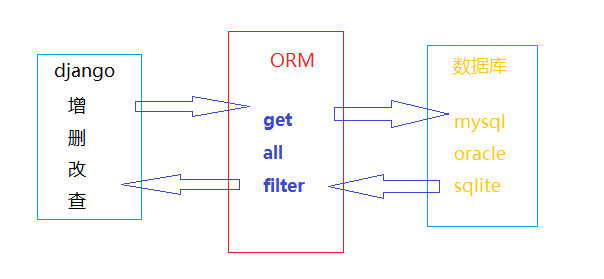

# 模型使用指南

### 前言
　　Django对数据库提供了很好的支持，对不同的数据库,django提供了统一调用的API，我们可以根据不同的业务需求使用不同是数据库。Django中引入了ORM(Objects Relational Mapping)对象关系映射，是一种程序技术。在下面会详细的讲解。

#### 修改mysql配置

##### 1. 在settings.py中配置数据库连接信息
```
'ENGINE':'django.db.backends.mysql',
'NAME':'',           #数据库名
'USER':'',           #账号
'PASSWORD':'',       #密码
'HOST':'127.0.0.1',  #IP(本地地址也可以是localhost)
'PORT':'3306',       #端口
```

##### 2. mysql数据库中创建定义的数据库
a) 进入mysql
```
mysql -u root -p
```
b) 创建数据库
```
create database xxx charset=utf-8;
```

##### 3. 配置数据库链接


a) 安装pymysql
```
pip install pymysql

```

b) 在工程目录下的__init__.py文件中输入,完成数据库的驱动加载
```
import pymysql
pymysql.install_as_MySQLdb()
```

##### 4. 定义模型

###### 重要概念：模型，表，属性，字段

一个模型类在数据库中对应一张表，在模型类中定义的属性，对应模型对照表中的一个字段

定义属性见定义属性文件[地址]()

###### 创建学生模型类

	class Student(models.Model):
	
	    s_name = models.CharField(max_length=10)
	    s_age = models.IntegerField()
	    s_gender = models.BooleanField()
	
	    class Meta:
	        db_table = 'cd_student'
	        ordering =[]
	    对象的默认排序字段，获取对象列表时使用，升序ordering['id']，降序ordering['-id']

##### 5.迁移数据库

a) 生成迁移文件
```
python manage.py makemigrations
```
注意：如果执行后并没有生成迁移文件，一直提示No changes detected这个结果的话，就要手动的去处理了。有两点处理方式：

1） 先删除掉__pycache__文件夹

2） 直接强制的去执行迁移命令，python manage.py makemigrations xxx (xxx就是app的名称)

3） 查看自动生成的数据库，查看表django_migrations，删掉app字段为xxx的数据(xxx就是app的名称)


b) 执行迁移生成数据库 
```
python manage.py migrate
```

注意: 生成迁移文件的时候，并没有在数据库中生成对应的表，而是执行migrate命令之后才会在数据库中生成表


##### 6. ORM

ORM(Objects Relational Mapping)对象关系映射，是一种程序技术，用于实现面向对象编程语言里不同类型系统的数据之间的转换。可以简单理解为翻译机。




##### 7.模型查询

###### a) 模型成员objects

Django默认通过模型的objects对象实现模型数据查询

###### b) 过滤器

查询集表示从数据库获取的对象集合

查询集可以有多个过滤器

过滤器就是一个函数，基于所给的参数限制查询的结果

	从SQL角度来说，查询集合和select语句等价，过滤器就像where条件
	
	Django有两种过滤器用于筛选记录
	
		filter	  : 返回符合筛选条件的数据集
	
		exclude   : 返回不符合筛选条件的数据集

多个filter和exclude可以连接在一起查询

当然还有如下这些过滤器:

    all()            返回所有数据
    
    filter()	 返回符合条件的数据
    
    exclude()        过滤掉符合条件的数据
    
    order_by()       排序
    
    values()         一条数据就是一个字典，返回一个列表

###### c) 查询单个数据

get()：返回一个满足条件的对象。如果没有返回符合条件的对象，会应该模型类DoesNotExist异常，如果找到多个，会引发模型类MultiObjectsReturned异常

first()：返回查询集中的第一个对象

last()：返回查询集中的最后一个对象

count()：返回当前查询集中的对象个数

exists()：判断查询集中是否有数据，如果有数据返回True，没有返回False


###### d) 限制查询集
限制查询集，可以使用下表的方法进行限制，等同于sql中的limit

 模型名.objects.all()[0:5] 小标不能为负数

###### e) 字段查询

对sql中的where实现，作为方法，filter(),exclude()，get()的参数

语法：属性名称__比较运算符 = 值

外键：属性名_id

注意：like语句中使用%表示通配符。比如sql语句查询  where name like '%xxx%'，等同于filter(name_contains='xxx')

###### f) 比较运算符

contains：是否包含，大小写敏感

startswith，endswith：以values开头或者结尾，大小写敏感
以上的运算符前加上i(ignore)就不区分大小写了

isnull，isnotnull：是否为空。filter(name__isnull=True)

in：是否包含在范围内。filter(id__in=[1,2,3])

gt，gte，lt，lte：大于，大于等于，小于，小于等于。filter(age__gt=10)

pk：代表主键，也就是id。filter(pk=1)


###### g) 聚合函数


agregate()函数返回聚合函数的值

Avg：平均值

Count：数量

Max：最大

Min：最小

Sum：求和                     

例如:  Student.objects.aggregate(Max('age'))

###### h) F对象/Q对象

<b>F对象:</b>可以使用模型的A属性与B属性进行比较

背景:在模型中有两个字段，分别表示学生成绩A与成绩B，要对成绩AB进行比较计算，就需要使用到F对象。

例如有如下例子1:

	班级中有女生个数字段以及男生个数字段，统计女生数大于男生数的班级可以如下操作:
	
	grades = Grade.objects.filter(girlnum__gt=F('boynum'))


F对象支持算数运算

grades = Grade.objects.filter(girlnum__gt=F('boynum') + 10)


例子2：

	查询python班下语文成绩超过数学成绩10分的学生
	
	    grade = Grade.objects.filter(g_name='python').first()
	    students = grade.student_set.all()
	
	    stu = students.filter(s_yuwen__gt= F('s_shuxue') + 10)


<b>Q对象:</b>

Q()对象就是为了将过滤条件组合起来

当我们在查询的条件中需要组合条件时(例如两个条件“且”或者“或”)时。我们可以使用Q()查询对象

使用符号&或者|将多个Q()对象组合起来传递给filter()，exclude()，get()等函数

Q()对象的前面使用字符“~”来代表意义“非”

例子1:
	
查询学生中不是12岁的或者姓名叫张三的学生

	student = Student.objects.filter(~Q(age=12) | Q(name='张三'))

例子2：

查询python班语文小于80并且数学小于等于80的学生
	
	grade = Grade.objects.filter(g_name='python').first()
	students = grade.student_set.all()
	stu = students.filter(~Q(s_yuwen__gte=80) & Q(s_shuxue__lte=80))


例子3：

查询python班语文大于等于80或者数学小于等于80的学生

	grade = Grade.objects.filter(g_name='python').first()
	students = grade.student_set.all()
	
	stu = students.filter(Q(s_yuwen__gte=80) | Q(s_shuxue__lte=80))


##### 8.模型字段定义属性

定义属性

	概述
		·django根据属性的类型确定以下信息
			·当前选择的数据库支持字段的类型
			·渲染管理表单时使用的默认html控件
			·在管理站点最低限度的验证
	
		·django会为表增加自动增长的主键列，每个模型只能有一个主键列，如果使用选项设置某属性为主键列后，则django不会再生成默认的主键列
	
		·属性命名限制
			·遵循标识符规则(不使用python预定义的标识符号，内置函数名，异常等。避免使用下划线等)
			·由于django的查询方式，不允许使用连续的下划线


	库
		·定义属性时，需要字段类型，字段类型被定义在django.db.models.fields目录下，为了方便使用，被导入到django.db.models中
	
		·使用方式
			·导入from django.db import models
			·通过models.Field创建字段类型的对象，赋值给属性

	逻辑删除
		·对于重要数据都做逻辑删除，不做物理删除，实现方法是定义isDelete属性，类型为BooleanField，默认值为False

	字段类型
		·AutoField
			·一个根据实际ID自动增长的IntegerField，通常不指定如果不指定，一个主键字段将自动添加到模型中
	
		·CharField(max_length=字符长度)
			·字符串，默认的表单样式是 TextInput
	
		·TextField
			·大文本字段，一般超过4000使用，默认的表单控件是Textarea
	
		·IntegerField
			·整数
	
		·DecimalField(max_digits=None, decimal_places=None)
			·使用python的Decimal实例表示的十进制浮点数
			·参数说明
				·DecimalField.max_digits
					·位数总数
				·DecimalField.decimal_places
					·小数点后的数字位数
	
		·FloatField
			·用Python的float实例来表示的浮点数
	
		·BooleanField
			·true/false 字段，此字段的默认表单控制是CheckboxInput
	
		·NullBooleanField
			·支持null、true、false三种值
	
		·DateField([auto_now=False, auto_now_add=False])
			·使用Python的datetime.date实例表示的日期
			·参数说明
				·DateField.auto_now
					·每次保存对象时，自动设置该字段为当前时间，用于"最后一次修改"的时间戳，它总是使用当前日期，默认为false
				·DateField.auto_now_add
					·当对象第一次被创建时自动设置当前时间，用于创建的时间戳，它总是使用当前日期，默认为false
			·说明
				·该字段默认对应的表单控件是一个TextInput. 在管理员站点添加了一个JavaScript写的日历控件，和一个“Today"的快捷按钮，包含了一个额外的invalid_date错误消息键
			·注意
				·auto_now_add, auto_now, and default 这些设置是相互排斥的，他们之间的任何组合将会发生错误的结果
	
		·TimeField
			·使用Python的datetime.time实例表示的时间，参数同DateField
	
		·DateTimeField
			·使用Python的datetime.datetime实例表示的日期和时间，参数同DateField
	
		·FileField
			·一个上传文件的字段
	
		·ImageField
			·继承了FileField的所有属性和方法，但对上传的对象进行校验，确保它是个有效的image

	字段选项
		·概述
			·通过字段选项，可以实现对字段的约束
			·在字段对象时通过关键字参数指定
	
		·null
			·如果为True，则该字段在数据库中是空数据，默认值是 False
	
		·blank
			·如果为True，则该字段允许为空白，默认值是 False
	
		·注意
			·null是数据库范畴的概念，blank是表单验证证范畴的
	
		·db_column
			·字段的名称，如果未指定，则使用属性的名称
	
		·db_index
			·若值为 True, 则在表中会为此字段创建索引
	
		·default
			·默认值
	
		·primary_key
			·若为 True, 则该字段会成为模型的主键字段
	
		·unique
			·如果为 True, 这个字段在表中必须有唯一值
