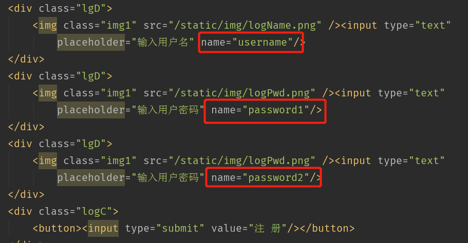
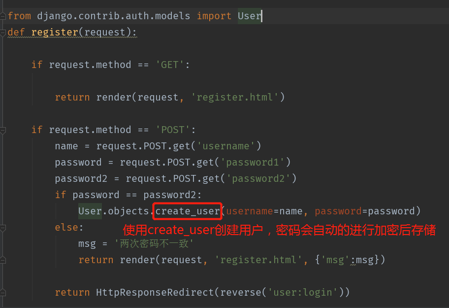
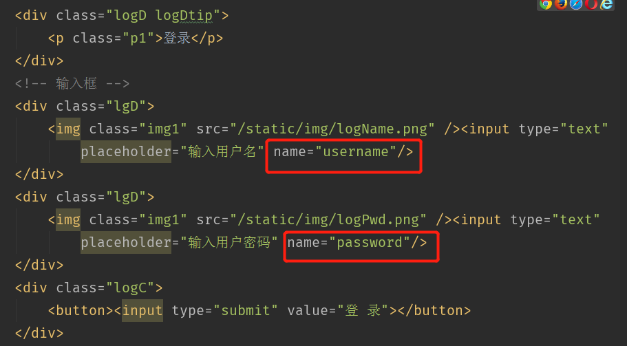
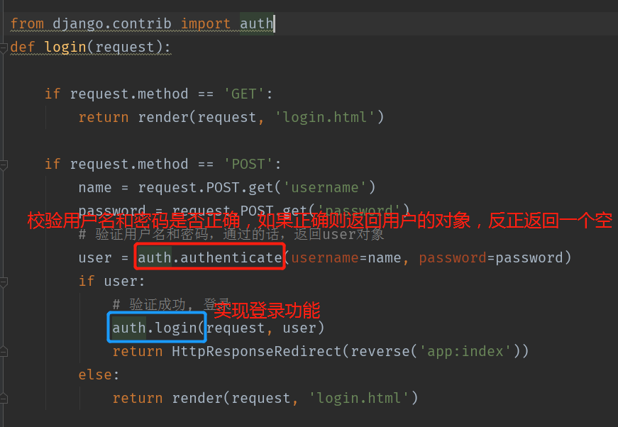

# 登录/注册/登录状态权限验证指南

### 前言

在django中，django帮我们封装好了登录注册以及注销的函数，在下面的代码案例中，我们将使用django定义好的注册登录注销函数去实现用户的登录验证，用户登录，以及用户注销等操作，以及定义login_rqueired装饰器，去装饰我们定义的函数，实现登录才能处理对应的业务逻辑

### 1. 实现注册方法

#### 1.1 页面提交注册字段

在页面的form中有一下三个字段，用户名和密码1和密码2，页面在submit提交的时候，会提交该三个字段后后端，在后端中获取该参数即可

#### 1.2 后端处理注册的信息

后端获取前端传递的参数，进行简单的验证后，进行创建用户的信息

### 2. 实现登录方法

#### 2.1 登录页面提交登录的字段

#### 2.2 后端进行登录的验证

### 3. 实现注销方法

### 4. 登录验证

	from django.contrib.auth.decorators import login_required

使用login_required装饰器去装饰自定义的视图函数