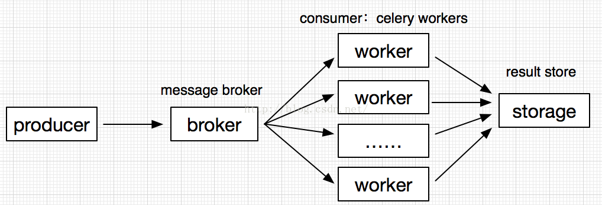
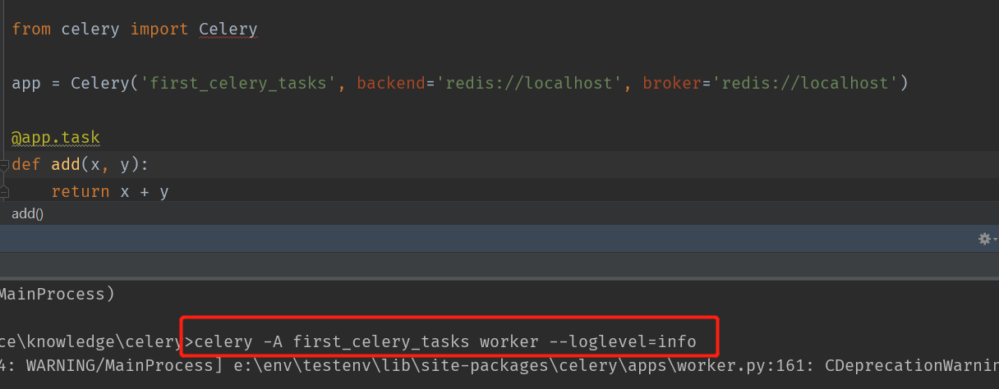
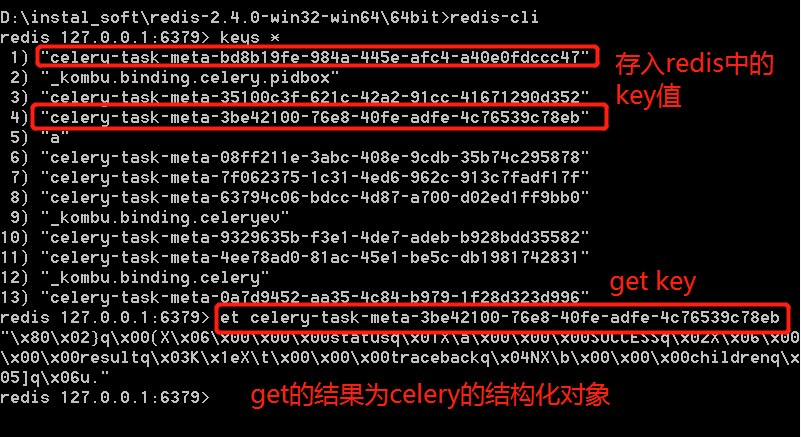

# celery使用指南

### 前言

来着官网中的英文解释:

Celery is a simple, flexible, and reliable distributed system to process vast amounts of messages.

It’s a task queue with focus on real-time processing, while also supporting task scheduling.

翻译：Celery是一个简单，灵活且可靠的分布式系统，用于处理大量的消息。

这是一个专注于实时处理的任务队列，同时也支持任务调度。

官网地址: [地址](http://docs.celeryproject.org)

#### 1. 高级信息队列协议

AMQP，即AdvancedMessage Queuing Protocol，高级消息队列协议，是应用层协议的一个开放标准，为面向消息的中间件设计。消息中间件主要用于组件之间的解耦，消息的发送者无需知道消息使用者的存在，反之亦然。

#### 2. 生产者与消费者模式概念


什么是生产者与消费者模式呢，某个模块负责产生数据，这些数据由另一个模块来负责处理（此处的模块是广义的，可以是类、函数、线程、进程等）。产生数据的模块，就形象地称为生产者；而处理数据的模块，就称为消费者。

单单抽象出生产者和消费者，还够不上是生产者消费者模式。该模式还需要有一个缓冲区处于生产者和消费者之间，作为一个中介。生产者把数据放入缓冲区，而消费者从缓冲区取出数据


#### 3. celery的架构

Celery的架构由三部分组成，消息中间件（message broker），任务执行单元（worker）和任务执行结果存储（task result store）组成。



<b>消息中间件（message broker）</b>：Celery本身不提供消息服务，但是可以方便的和第三方提供的消息中间件集成。包括，<b>RabbitMQ, Redis</b>, MongoDB ，SQLAlchemy等，其中rabbitmq与redis比较稳定，其他处于测试阶段。

 <b>任务执行单元（worker）</b>：Worker是Celery提供的任务执行的单元，worker并发的运行在分布式的系统节点中。

 <b>任务结果存储（result store）</b>：result store用来存储Worker执行的任务的结果，支持AMQP，redis，mongodb，mysql等主流数据库。

#### 4. 插件安装

##### 4.1 安装celery，redis以及相关的依赖包

```
pip install -U celery[redis]
```

配置非常简单，只需要设置 Redis 数据库的位置:

BROKER_URL = 'redis://localhost:6379/0'

URL 的格式为:

redis://:password@hostname:port/db_number


##### 4.2 创建官网上简单的celery案例

案例中使用redis作为信息中间件broker:



代码解释： 

1. 直接初始化Celery对象，指定信息中间件，使用redis进行链接

2. 使用celery对象的task装饰我们需要异步的函数

简单的两步就实现了celery的异步函数

执行命令解释：

启动一个随时监听异步任务处理函数的worker，使用命令celery -A xxxx模块名 worker --loglevel=info，其中该命令中-A参数表示我们创建的py文件为tasks.py文件的话，则celery -A tasks worker --loglevel=info 

执行异步函数：

进入python环境进行测试功能，使用delay()来会掉我们创建的任务:


注意：

采用delay()函数来创建我们的回调函数，如果直接使用add(1，2)就和普通的函数没有任何区别了。

##### 4.3 查看redis中存入的结果值

当执行了delay()方法以后，都会在控制台看到打印了存入redis中的key的信息

先查看一下，当我们调用delay()回调任务的时候，打印的结果：


再来查看一下，redis中的key值，以及对应的value值的结果。value值为celery存入的结构化对象，需要使用celery的api获取这些值。




#### 5. django中配置celery


