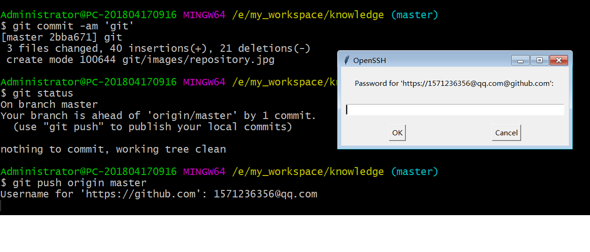
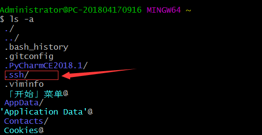
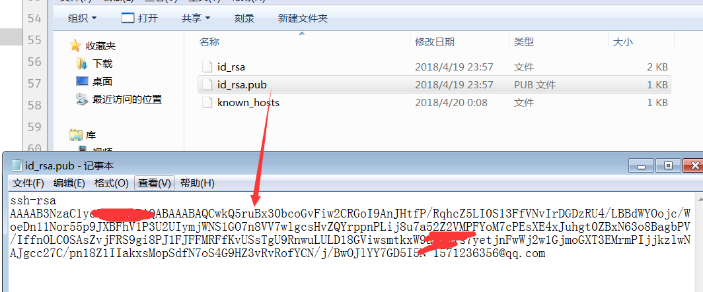

# GIT使用指南


**前言**：
##### 什么是git
git是<u>分布式版本控制系统</u>。分布式版本控制系统也还有svn。

##### 什么是分布式控制，什么是集中式控制系统

集中式版本控制，主要有SVN。该模式的版本控制是由一台电脑作为中央服务器，程序猿工作的时候用自己的电脑先要从中央服务器上把代码给拉取(pull)下来，
然后在编写自己的代码，最后提交代码到中央服务器上。该模式下必须联网才能完成操作。


分布式控制，主要有Git。该模式的版本控制没有中央服务器的概念，每一个程序猿的电脑都是一个版本库。也就是说，每一个程序猿的电脑上都有整个项目的代码，
不只是自己版本的代码，还有其他人的版本的代码。所以要是换同事程序猿的电脑挂了，从你的电脑上一样的可以把他写的分支上的代码给copy出来。当然在正式
开发中还是有一个类似于中央服务器的一台服务器，我们自己电脑的代码还是需要推到该服务器上，最后通过该服务器整合代码发布到线上测试环境去进行测试以
及上线。


```
在程序猿小哥哥的电脑上一般会涉及到到三个分支：
master(线上分支)，dev(开发环境分支)，test(测试分支)，wanghaifei(自己开发分支)
```


##### git的一些基本概念

###### 1.git工作区域
    git工作区域分为工作区，缓存区
    工作区其实就是整个项目的文件目录，其中有很多一个隐藏文件叫.git，该文件就是git的版本库。在该.git文件中有很多配置文件，最重要的是就是stage
    或者叫index的暂存区，还有git在我们创建项目的时候默认创建了第一个master分支，以及指向该master分支的一个指针head。
    该图说明
    <br>
    
    
    那提交怎么从本地到缓存区以及最后到远程的分支上的呢：
    1. 首先第一步git add其实就是讲我们本地修改了的代码提交到缓存区中
    2. 第二部git commit就是讲我们缓存区中的代码提交到本地分支中，并清空缓存区域
    3. 最后一步git push origin master，就是讲我们本地分支的代码推到远程remote的master分支上

###### 2. git提交代码
设置了全局变量以后，在以后的每一次提交代码都会提示输入git的username和对于的密码


##### git秘钥设置
    1. git支持https和git两种传输协议,其中使用https协议的时候，每次pull, push都会提示要输入密码
    2. 使用ssh协议，在配置好秘钥，就可以使用无需每次输入账号密码了

###### 1. 设置全局变量


###### 2. 生成rsa加密文件
 a) 找到git bash可执行文件，并且运行，使用ls -a命令去查看所有的文件，包括隐藏文件，找到.ssh文件，如果没有该文件则mkdir .ssh文件夹
 <br>
 
 <br>
***
 b) 进入ssh文件，生成秘钥
 
 <br>
 在命令执行中连续敲三次回车即可。
 <br> <br>
***
 c) 配置git中ssh秘钥
 首先：先查看ssh文件夹的结构，打开id_rsa.pub，并复制其中的信息
 <br> <br>
 
 <br> <br>
***
 其次：打开github，点击setting然后配置ssh秘钥
 <br>
 <br>
 


