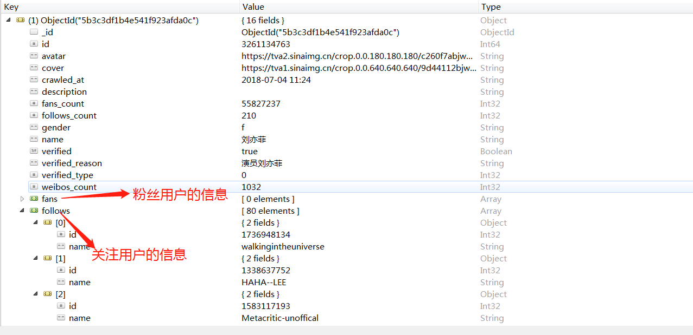

# 爬虫学习使用指南--scrapy框架--微博关注信息

### 2. 爬取微博用户关注信息

#### 2.1 定义爬虫获取关注用户的信息

在我们定义的spider爬虫文件中，再加入需要爬取的粉丝的follow_url地址，定义爬取地址的回调函数parse_follows

	import json
	
	from scrapy.spiders import Spider
	from scrapy import Request
	
	from dbspider.items import UserItem, UserRelationItem

	class WeiboSpider(Spider):
	    name = 'weibocn'
	
	    allowed_domains = ['m.weibo.cn']
	    # 获取微博用户的基本信息
	    user_url = 'https://m.weibo.cn/api/container/getIndex?uid={uid}&type=uid&value={uid}&containerid=100505{uid}'
	
	    # 关注url
	    follow_url = 'https://m.weibo.cn/api/container/getIndex?containerid=231051_-_followers_-_{uid}&page={page}'
	
	    # 用户的id
	    # start_users = ['3217179555', '1742566624', '2282991915', '1288739185', '3952070245', '5878659096']
	    start_users = ['3261134763']
	
	    # 该方法必须返回一个可迭代对象(iterable)。该对象包含了spider用于爬取的Request。
	    # 当spider启动爬取并且未指定start_urls时，该方法被调用。
	    def start_requests(self):
	        for uid in self.start_users:
	            yield Request(self.user_url.format(uid=uid), callback=self.parse_user)
	
	    # 当请求url返回网页没有指定回调函数时，默认的Request对象回调函数
	    def parse_user(self, response):
	        """
	        解析用户信息
	        :param response: Response对象
	        """
	        result = json.loads(response.text)
	        if result.get('data').get('userInfo'):
	            user_info = result.get('data').get('userInfo')
	            user_item = UserItem()
	            field_map = {
	                'id': 'id', 'name': 'screen_name', 'avatar': 'profile_image_url', 'cover': 'cover_image_phone',
	                'gender': 'gender', 'description': 'description', 'fans_count': 'followers_count',
	                'follows_count': 'follow_count', 'weibos_count': 'statuses_count', 'verified': 'verified',
	                'verified_reason': 'verified_reason', 'verified_type': 'verified_type'
	            }
	            for field, attr in field_map.items():
	                user_item[field] = user_info.get(attr)
	            yield user_item
	
	            # 关注
	            uid = user_info.get('id')
	            yield Request(self.follow_url.format(uid=uid, page=1), callback=self.parse_follows,
	                          meta={'page': 1, 'uid': uid})
	
	    def parse_follows(self, response):
	        """
	        解析用户关注
	        :param response: Response对象
	        """
	        result = json.loads(response.text)
	        if result.get('ok') and result.get('data').get('cards') and len(result.get('data').get('cards')) and \
	                result.get('data').get('cards')[-1].get(
	                        'card_group'):
	            # 解析用户
	            follows = result.get('data').get('cards')[-1].get('card_group')
	            for follow in follows:
	                if follow.get('user'):
	                    uid = follow.get('user').get('id')
	                    yield Request(self.user_url.format(uid=uid), callback=self.parse_user)
	
	            uid = response.meta.get('uid')
	            # 关注列表
	            user_relation_item = UserRelationItem()
	            # 获取关注的用户信息
	            follows = [{'id': follow.get('user').get('id'), 'name': follow.get('user').get('screen_name')} for follow in
	                       follows]
	            user_relation_item['id'] = uid
	            user_relation_item['follows'] = follows
	            user_relation_item['fans'] = []
	            yield user_relation_item
	            # 下一页关注
	            page = response.meta.get('page') + 1
	            yield Request(self.follow_url.format(uid=uid, page=page),
	                          callback=self.parse_follows, meta={'page': page, 'uid': uid})

​	

#### 2.2 定义分数的item实体

	class UserRelationItem(scrapy.Item):
	    collection = 'users'
		
		# 微博用户的id
	    id = scrapy.Field()
		# 微博用户关注的列表
	    follows = scrapy.Field()
		# 微博用户的粉丝的列表
	    fans = scrapy.Field()

#### 2.3 pipelines持久化

在之前的持久化中加入额外的判断信息：

1. 判断如果是UserItem类型的数据，则初始化创建时间的字段参数
2. 存储数据的时候，也分类型进行存储。如果是UserItem类型的数据，则说明该数据是爬取到的微博用户的信息，则直接进行保存
3. 如果获取到的数据是UserRelationItem类型的数据，则说明爬取的数据时微博用户的关注人的信息，则直接将获取到的关注的信息加入到对应的微博用户的collections中

代码如下：

	class TimePipeline(object):
	
	    def process_item(self, item, spider):
	        # 如果是UserItem类型的，则添加创建时间字段
	        if isinstance(item, UserItem):
	            now = time.strftime('%Y-%m-%d %H:%M', time.localtime())
	            item['crawled_at'] = now
	        return item

	class WeiboPipeline(object):
	
	    def process_item(self, item, spider):
	
	        return item

	class MongoPipeline(object):
	    def __init__(self):
	        self.mongo_uri = settings['MONGODB_SERVER']
	        self.mongo_db = settings['MONGODB_DB']
	
	    # 当蜘蛛打开时调用此方法
	    def open_spider(self, spider):
	        self.client = pymongo.MongoClient(self.mongo_uri)
	        self.db = self.client[self.mongo_db]
	
	    # 当蜘蛛关闭时调用此方法。
	    def close_spider(self, spider):
	        self.client.close()
	
	    def process_item(self, item, spider):
	        # 如果是保存微博用户信息则直接保存或者更新
	        if isinstance(item, UserItem):
	            self.db[item.collection].update({'id': item.get('id')}, {'$set': item}, True)
	
	        # 如果是粉丝的信息，则添加到用户的集合中
	        if isinstance(item, UserRelationItem):
	            self.db[item.collection].update(
	                {'id': item.get('id')},
	                {'$addToSet':
	                    {
	                        'follows': {'$each': item['follows']},
	                        'fans': {'$each': item['fans']}
	                    }
	                }, True)
	        return item

#### 2.4 运行结果

